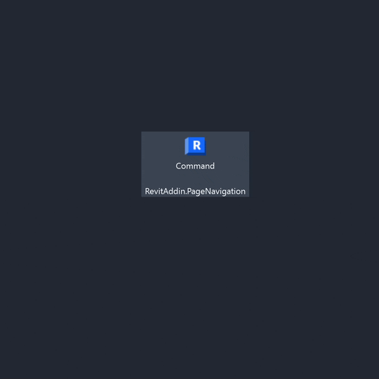

# RevitAddin.PageNavigation

This project was generated by the [ricaun.AppLoader](https://ricaun.com/AppLoader/) Revit plugin.

## Description

Experiment project using `Frame` to navigate between pages in a Revit addin.

## Installation

* Download and install [RevitAddin.PageNavigation.exe](../../releases/latest/download/RevitAddin.PageNavigation.zip)

## License

This project is [licensed](LICENSE) under the [MIT Licence](https://en.wikipedia.org/wiki/MIT_License).

---

Do you like this project? Please [star this project on GitHub](../../stargazers)!